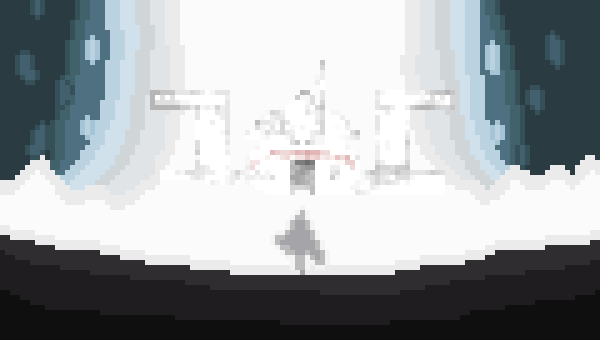

<div align="center">
  
  <h2>Hi, I'm Lucas Santos!</h2>
  <p>
    Sou formado em ADS na UniVS, após alguns experimentos acabei descobrindo que sou apaixonado por desenvolvimento android, desde então sigo estudando e me aprimorando cada vez mais.
  </p>
</div>

###  Mais sobre mim


```kotlin
object Lucas {
 val name = "José Lucas da Silva Santos"
 val acknowledgements = "Android Kotlin Developer"
 
 val languages = listOf("Kotlin", "Java", "JavaScript")
 
}
```

### **Linguagens e Ferramentas:**  

<code></code>
<code></code>
<code></code>
<code></code>
<code></code>
<code></code>

### **GitHub Estatísticas**
<a href="https://github.com/zLuCaS2K">
 
</a>

<br/>
<br/>

<div>
  <!-- Gmail --->
  <a href = "mailto:LuucasSantos.Dev@Gmail.com">
    
  </a>
  <!-- Instagram --->
  <a href="https://instagram.com/luucas_dev" target="_blank">
    
  </a>
  <!-- Linkedin --->
  <a href="https://www.linkedin.com/in/luucassantos/" target="_blank">
    
  </a> 
</div>
